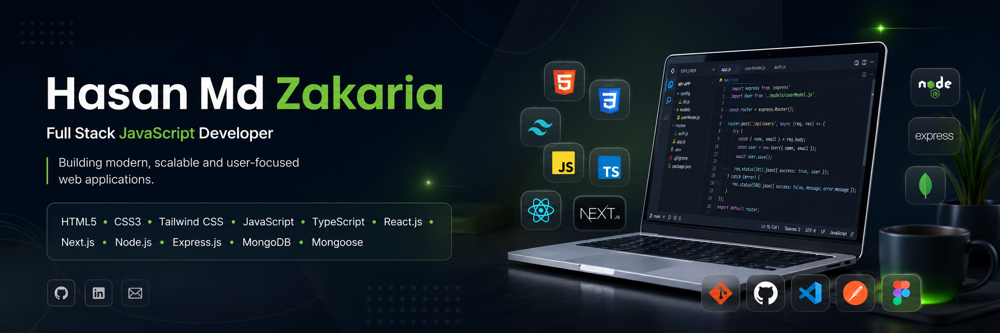

<!-- =================================================== -->
<!--                 HERO BANNER                         -->
<!-- =================================================== -->

  

<!-- =================================================== -->
<!--              ANIMATED TYPING                        -->
<!-- =================================================== -->

---

# 👨‍💻 About Me

I'm a passionate **Full Stack Developer** with **3+ years of professional WordPress development experience**.

I specialize in building **modern**, **responsive**, **scalable**, and **user-focused** web applications using **React**, **Next.js**, **TypeScript**, **Node.js**, **Express.js**, and **MongoDB**.

I enjoy solving real-world problems, writing clean and maintainable code, and continuously learning modern technologies to become a better software engineer every day.

> **"Code with purpose. Build with passion. Learn continuously."**

---

<!-- =================================================== -->
<!--                  TECH STACK                         -->
<!-- =================================================== -->

# 🛠 Tech Stack

### 🎨 Frontend

### ⚙ Backend

### 🗄 Database

**Also Experienced With**

- Mongoose
- REST API Development

### 🎭 UI Libraries

- HeroUI
- DaisyUI
- shadcn/ui

### 🛠 Tools & Platforms

---

# 💼 Professional Experience

### 💻 WordPress Developer

**3+ Years of Professional Experience**

Experienced in building high-performance, responsive and business-focused websites using modern WordPress technologies.

### Expertise

- Custom WordPress Development
- Elementor Pro
- WooCommerce
- Crocoblock
- Booking Systems
- Responsive Web Design
- Website Performance Optimization
- Bug Fixing & Maintenance

---

# 🚀 What I Build

I enjoy building modern web applications such as:

- 🩺 Healthcare Management Systems
- 💼 Job Portal Platforms
- 🛒 E-commerce Applications
- 🚗 Vehicle Rental Platforms
- 📅 Appointment Booking Systems
- 👥 Dashboard Applications
- 🔐 Authentication Systems
- 📊 Admin Panels

---

# 🌱 Currently Exploring

- Advanced TypeScript
- Next.js App Router
- Authentication & Authorization
- Backend Architecture
- System Design Fundamentals
- Performance Optimization
- Scalable REST APIs
- Clean Code Principles

---

# 🎯 Career Objective

My goal is to become a highly skilled **Full Stack Developer**, build impactful software solutions, contribute to open-source projects, and work with global teams while continuously learning and improving my engineering skills.

---
<!-- =================================================== -->
<!--                FEATURED PROJECTS                    -->
<!-- =================================================== -->

# 🚀 Featured Projects

## 🩺 Medicare Connect

A modern healthcare management platform that enables patients to book appointments, make secure online payments, and manage prescriptions through dedicated dashboards.

**Tech Stack:** Next.js • React • TypeScript • Node.js • Express.js • MongoDB • Tailwind CSS • Better Auth

---

## 🛒 SunCart

A modern e-commerce application featuring authentication, shopping cart functionality, and responsive product management.

**Tech Stack:** Nest.js • React.js • Tailwind CSS • Better-Auth • Mongodb • Hero UI

---
## 🚗 Car-Rental

A full-stack car rental platform designed to simplify the vehicle booking experience with secure authentication, responsive design, seamless reservation management, and a modern user interface.

**Tech Stack:** Next.js • React.js • Tailwind CSS • Better Auth • Node.js • Express.js • MongoDB • HeroUI

---

## 📋 GitHub Issues Tracker

A JavaScript project demonstrating DOM manipulation, issue tracking, filtering, searching, and clean UI design.

**Tech Stack:** HTML5 • CSS3 • JavaScript

---

<!-- =================================================== -->
<!--                GITHUB ANALYTICS                     -->
<!-- =================================================== -->

# 📊 GitHub Analytics

---

# 🔥 GitHub Streak

---

# 📈 Contribution Graph

---

# 📬 Get In Touch

- 📧 **Email:** `zakariak4@gmail.com`
- 💼 **LinkedIn:** https://www.linkedin.com/in/hasanmdzakaria/
- 🌐 **Portfolio:** Coming Soon

---

<!-- =================================================== -->
<!--                 THANK YOU                           -->
<!-- =================================================== -->

## ⭐ Thanks for visiting my GitHub Profile!

I appreciate your time exploring my work.

If you find my projects interesting, consider giving them a ⭐ and feel free to connect.

### 🚀 Let's build something amazing together.

---

**"Code with purpose. Learn continuously. Build for impact."**

